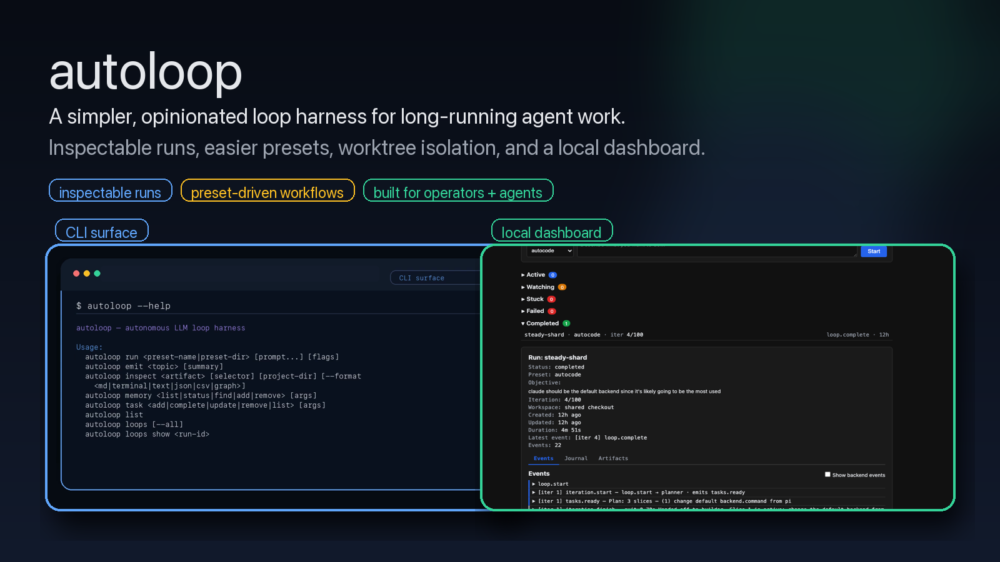

# autoloop

autoloop is a spinoff of ralph-orchestrator built to keep the parts that mattered and drop a lot of the extra experimental surface area.

It’s a simpler, more opinionated loop harness for long-running agent work: inspectable runs, easier preset-driven workflows, and operator surfaces that agents can use directly too.

It’s early and still evolving. autoloop is not a replacement for ralph-orchestrator — it’s a cleaner path for exploring a simpler UX without breaking Ralph.

[](https://www.npmjs.com/package/@mobrienv/autoloop)
[](https://mikeyobrien.github.io/autoloop/)
[](https://nodejs.org/)

**[Read the docs →](https://mikeyobrien.github.io/autoloop/)**

[](docs/launches/autoloop-hybrid-launch-video-x.mp4)

## Use as a library

As of `0.5.0-sdk.0`, autoloop ships an embed-able runtime alongside the CLI. Pass an `AbortSignal` for cancellation and an `onEvent` callback to consume the structured event stream — no terminal output is produced unless you ask for it.

```ts
import { run, type LoopEvent } from "@mobrienv/autoloop";

const controller = new AbortController();
setTimeout(() => controller.abort(), 60_000);

const summary = await run("./my-project", "build the login page", "autoloop", {
  signal: controller.signal,
  onEvent: (event: LoopEvent) => {
    if (event.type === "iteration.start") console.log(`iter ${event.iteration}`);
    if (event.type === "loop.finish") console.log(`done: ${event.stopReason}`);
  },
});

console.log(summary); // { iterations, stopReason, runId }
```

The CLI entry (`bin/autoloop`) is still the primary interface; the library export is for agent frameworks and dashboards that want to drive loops in-process.

## Why autoloop exists

ralph-orchestrator grew to include a lot of different experiments and ways of doing things. autoloop spins out a narrower set of ideas into something simpler and more opinionated.

The bet is that long-running agent workflows get much better when they are:

- inspectable after every iteration
- easy to launch through reusable presets
- safe to run in isolation when they touch real code
- operable by both humans and agents

If Ralph is the broader experimentation surface, autoloop is the cleaner runtime path.

## What it emphasizes

- **Inspectable long-running loops** -- every iteration is recorded in an append-only journal, with tools to inspect prompts, outputs, topology, metrics, tasks, memory, and artifacts
- **Easier preset-driven workflows** -- bundled presets give you a fast starting point, and custom preset creation is a first-class path
- **Operator visibility** -- `loops`, `watch`, `health`, `inspect`, and the local dashboard show what actually happened
- **Worktree isolation + automerge** -- run risky coding passes in git worktrees and merge them back only when ready
- **Designed for agents too** -- autoloop is intentionally shaped as a surface that agents can use directly, not just a human operator CLI
- **Dynamic chains** -- compose presets into multi-stage pipelines
- **Persistent memory + profiles** -- loops accumulate learnings across runs and can load repo/user tuning profiles

## What autoloop is

- a simpler, more opinionated spinoff of ralph-orchestrator
- a loop harness for long-running agent workflows
- a system built around inspectability, presets, and operator visibility
- a tool for both human operators and agents

## What it is not

- not a replacement for ralph-orchestrator
- not just a thin CLI wrapper around model calls
- not a generic workflow engine for everything
- not optimized for the broadest possible feature surface

## Table of contents

- [Why autoloop exists](#why-autoloop-exists)
- [What it emphasizes](#what-it-emphasizes)
- [What autoloop is](#what-autoloop-is)
- [What it is not](#what-it-is-not)
- [Install](#install)
- [Quick start](#quick-start)
- [Usage](#usage)
- [Bundled presets](#bundled-presets)
- [Creating custom presets](#creating-custom-presets)
- [Project structure](#project-structure)
- [Developer scripts](#developer-scripts)
- [Running tests](#running-tests)
- [Further reading](#further-reading)
- [Contributing](#contributing)

## Install

### From npm (recommended)

```bash
npm install -g @mobrienv/autoloop
```

### From source

```bash
git clone https://github.com/mikeyobrien/autoloop.git && cd autoloop
npm install
npm run build
node bin/autoloop --help
```

## Quick start

```bash
# Run a bundled preset
autoloop run autocode "Fix the login bug"

# Inspect active and recent runs
autoloop loops

# Open the local dashboard
autoloop dashboard

# Keep an implementation pass isolated in a git worktree
autoloop run autocode --worktree --automerge "Implement the approved fix"
```

`autocode` is a bundled preset. The quoted string is the objective passed to the loop.

The usual golden path is:

1. start a loop with a preset
2. watch it move through iterations
3. inspect the journal, events, and artifacts
4. open the dashboard when you want a higher-level operator view
5. use worktree isolation when the loop is making risky repo changes

## Usage

The main commands are:

```
autoloop run <preset-name|preset-dir> [prompt...] [flags]
autoloop list
autoloop loops [--all]
autoloop loops show <run-id>
autoloop loops artifacts <run-id>
autoloop loops watch <run-id>
autoloop inspect <artifact> [selector] [project-dir] [--format <md|terminal|text|json|csv|graph>]
autoloop dashboard [--port <port>]
autoloop worktree <list|show|merge|clean> [args]
autoloop chain <list|run> [args]
autoloop emit <topic> [summary]
autoloop memory <list|status|find|add|remove> [args]
autoloop task <add|complete|update|remove|list> [args]
autoloop runs clean [--max-age <days>]
autoloop config <show|set|unset|path> [args]
```

Use `run` to start work, `loops` and `inspect` to understand what happened, and `dashboard` when you want a local operator surface.

### Flags

| Flag | Description |
|------|-------------|
| `-h`, `--help` | Show usage |
| `-v`, `--verbose` | Debug-level logging |
| `-b`, `--backend` | Override backend command (e.g. `-b claude`) |
| `-p`, `--preset` | Resolve a named or custom preset |
| `--chain` | Run an inline chain of comma-separated presets |
| `--profile <spec>` | Activate a profile (`repo:<name>` or `user:<name>`), repeatable |
| `--no-default-profiles` | Suppress config-defined default profiles |

### Examples

```bash
# Run a preset against a coding task
autoloop run autocode "Refactor the auth module"

# Run a QA pass
autoloop run autoqa "Exercise the new onboarding flow and report UX issues"

# Run from a custom preset directory
autoloop run ./my-preset "Analyze the API"

# Keep implementation isolated in a worktree
autoloop run autocode --worktree --automerge "Implement the approved fix"

# Watch a run in progress
autoloop loops watch <run-id>

# Inspect what happened after the run completes
autoloop inspect journal <run-id>
autoloop loops artifacts <run-id>

# Open the dashboard
autoloop dashboard

# Run an inline chain
autoloop run --chain autospec,autocode "Design and build feature X"
```

## Bundled presets

Bundled presets give you opinionated starting points for common workflows like coding, QA, docs, review, security, specs, and performance.

| Preset | Purpose |
|--------|---------|
| `autocode` | Plan, build, review, and commit code changes |
| `autosimplify` | Scope, simplify, verify, and review code for simplicity |
| `autoideas` | Scan, analyze, review, and synthesize improvement ideas |
| `autoresearch` | Research strategies, implement, evaluate, and benchmark |
| `autoqa` | Plan, execute, inspect, and report on QA |
| `autotest` | Survey, write, run, and assess tests |
| `autofix` | Diagnose, fix, and verify bugs |
| `autoreview` | Read, suggest, check, and summarize code reviews |
| `autodoc` | Audit, write, verify, and publish documentation |
| `autosec` | Scan, analyze, harden, and report on security |
| `autoperf` | Profile, measure, optimize, and judge performance |
| `autospec` | Research, clarify, design, plan, and critique specifications |
| `automerge` | Merge a completed worktree branch back into its base branch |
| `autopr` | Turn the current branch into a reviewable pull request |

## Creating custom presets

A preset is a directory containing `autoloops.toml`, `topology.toml`, `harness.md`, and a `roles/` folder. See [Creating presets](https://mikeyobrien.github.io/autoloop/guides/creating-presets) for the full guide, or examine any `presets/<name>/` directory as a working example.

Some older or internal layouts may still include `miniloops.toml`, but `autoloops.toml` is the canonical entry point for new presets.

## Project structure

```
autoloop/
├── bin/autoloop        # CLI entry point (Node.js ESM)
├── src/                # TypeScript source
│   ├── main.ts         # CLI dispatch
│   ├── harness/        # Loop engine (iteration, events, routing)
│   ├── config.ts       # TOML config loading
│   ├── chains.ts       # Chain orchestration
│   ├── memory.ts       # Persistent loop memory
│   └── usage.ts        # Help text
├── presets/            # Bundled preset definitions
│   └── <name>/
│       ├── autoloops.toml
│       ├── topology.toml
│       ├── harness.md
│       └── roles/
├── docs/               # Reference documentation
├── dist/               # Compiled output (generated)
└── package.json
```

## Developer scripts

A convenience dispatcher lives at `bin/dev`:

```bash
bin/dev build          # compile TypeScript
bin/dev test           # run the test suite
bin/dev test:watch     # vitest in watch mode
bin/dev hooks          # install git hooks
bin/dev run [args]     # run autoloop
bin/dev --help         # list all subcommands
```

## Running tests

```bash
npm test
```

Runs the test suite via [Vitest](https://vitest.dev/).

### Mock backend

A deterministic mock backend (`src/testing/mock-backend.ts`) removes the need for a live LLM during testing. Point it at a JSON fixture to control output, exit code, and emitted events:

```bash
export MOCK_FIXTURE_PATH=test/fixtures/backend/complete-success.json
node bin/autoloop run . -b "node dist/testing/mock-backend.js"
```

See [CLI reference](https://mikeyobrien.github.io/autoloop/reference/cli#mock-backend) for fixture schema and bundled scenarios.

## Further reading

- [Platform architecture](https://mikeyobrien.github.io/autoloop/concepts/platform)
- [Configuration reference](https://mikeyobrien.github.io/autoloop/reference/configuration)
- [Creating presets](https://mikeyobrien.github.io/autoloop/guides/creating-presets)
- [Topology and event routing](https://mikeyobrien.github.io/autoloop/reference/topology)
- [Memory system](https://mikeyobrien.github.io/autoloop/reference/memory)
- [Dynamic chains](https://mikeyobrien.github.io/autoloop/features/dynamic-chains)
- [CLI reference](https://mikeyobrien.github.io/autoloop/reference/cli)
- [Dashboard](https://mikeyobrien.github.io/autoloop/features/dashboard)
- [Profiles](https://mikeyobrien.github.io/autoloop/features/profiles)
- [Tasks](https://mikeyobrien.github.io/autoloop/features/tasks)
- [Worktree isolation](https://mikeyobrien.github.io/autoloop/features/worktree)
- [Releasing](https://mikeyobrien.github.io/autoloop/development/releasing)

## Contributing

Bug reports and pull requests are welcome at [github.com/mikeyobrien/autoloop](https://github.com/mikeyobrien/autoloop/issues).

Prerequisites for development: Node.js >= 18, npm. Run `npm install && npm run build` to get started, then `npm test` to verify.
