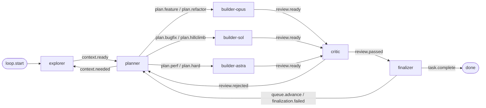

# autorigor

Use when you want rigor-mode engineering with each playbook lane routed to its own model and harness.

The planner classifies each slice into a playbook lane. Each lane runs on its own harness and model.

## Routing

| Role | Harness | Model | Purpose |
| --- | --- | --- | --- |
| explorer | pi | `spark/qwen3.8-flash-next` | Maps the subsystem into `how.md` |
| planner | pi | `openai-codex/gpt-6-sol` | Picks the playbook and lane, names the data shape |
| builder-opus | Claude Agent SDK | `claude-opus-5-5` | `plan.feature`, `plan.refactor` |
| builder-sol | pi | `openai-codex/gpt-6-sol` | `plan.bugfix`, `plan.hillclimb` |
| builder-astra | pi | `openai-codex/gpt-6-astra` | `plan.perf`, `plan.hard` |
| critic | pi | `xai/grok-4.7` | Independent review on a different model family |
| finalizer | pi | `openai-codex/gpt-6-sol` | Whole-task completion gate |



A slice rejected twice in one lane escalates to `plan.hard`.

## Run

```sh
autoloop run autorigor "objective" --worktree
```

Requires `pi` with the `openai-codex`, `xai`, and `spark` providers configured, and the `claude` CLI signed in.

## Changing a lane

Edit the role's `backend_kind`, `backend_command`, and `backend_model` in `topology.toml`. Roles without overrides use `backend.*` from `autoloops.toml`. `-b` on the command line replaces the base backend only. Role overrides still apply.

Keep each lane event routed to exactly one role. The harness picks the backend from the first role a handoff names.
